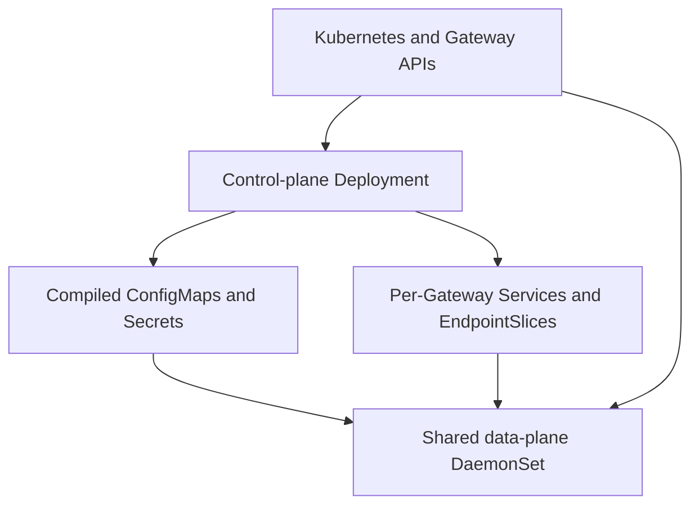

# krouter — Proof-of-Concept Specification

Status: Draft 0.1  
Date: 2026-07-20

## 1. Purpose

`krouter` (Kubernetes Router) is a Kubernetes Gateway API implementation and HTTP/HTTPS reverse proxy written in Go.

The proof of concept (POC) implements the Gateway API `GATEWAY-HTTP` Core conformance profile. The architecture must remain extensible to the other Standard Gateway API route types and features without introducing krouter-specific Kubernetes custom resources.

## 2. Design principles

1. Use standard Kubernetes and Gateway API resources wherever possible.
2. Define no krouter-specific CRDs.
3. Require the Gateway API CRDs to be installed before krouter.
4. Keep the control plane out of the request path.
5. Keep the data plane stateless and able to serve its last valid configuration during control-plane failures.
6. Apply routing updates atomically without interrupting active connections.
7. Share compute between Gateways by default. Operators requiring compute isolation install another krouter instance with a different GatewayClass/controller name.
8. Use one Go binary and one container image for both components.

## 3. Compatibility and POC scope

| Item | POC requirement |
|---|---|
| Kubernetes | v1.31 or newer |
| Gateway API | v1.5.1, Standard channel |
| Conformance target | All Core tests in `GATEWAY-HTTP` |
| Client protocols | HTTP/1.1 and HTTP/2 |
| Backend protocol | HTTP/1.1 for the POC |
| Listeners | HTTP and HTTPS with TLS termination |
| Proxy implementation | Go `net/http` and `httputil.ReverseProxy` |
| Backend discovery | Kubernetes Services and EndpointSlices |
| Backend health | EndpointSlice conditions only |
| Authentication | Out of scope |
| Rate limiting | Out of scope |
| Experimental Gateway API features | Out of scope |
| Standard-channel Extended features | Out of scope unless required by a Core conformance test |

The control plane must inspect the `gateway.networking.k8s.io/bundle-version` annotation on installed Gateway API CRDs and publish the GatewayClass `SupportedVersion` condition. Unsupported bundles must not be reconciled as if they were compatible.

## 4. Installation

krouter is distributed as:

- One container image containing a single Go binary.
- One static Kubernetes manifest.
- One `krouter-system` namespace.
- One single-replica control-plane Deployment.
- One shared data-plane DaemonSet.
- The ServiceAccounts, RBAC, and management Services required by those components.

The manifest does not install Gateway API CRDs.

The binary role is selected with `KROUTER_MODE=controlplane` or `KROUTER_MODE=dataplane`. Installation-level application settings use `KROUTER_*` environment variables. Pod scheduling fields such as node selectors, affinity, and tolerations remain ordinary fields in the installation manifest.

At minimum, the installation exposes these settings:

| Environment variable | Meaning |
|---|---|
| `KROUTER_MODE` | `controlplane` or `dataplane` |
| `KROUTER_CONTROLLER_NAME` | Unique Gateway API controller name owned by this installation |
| `KROUTER_SYSTEM_NAMESPACE` | Namespace containing krouter; defaults to `krouter-system` |
| `KROUTER_INTERNAL_PORT_MIN` | First allocatable data-plane listener port |
| `KROUTER_INTERNAL_PORT_MAX` | Last allocatable data-plane listener port |
| `KROUTER_MANAGEMENT_PORT` | Health, status, and metrics port |
| `KROUTER_LOG_LEVEL` | `log/slog` minimum level |

The default internal listener range must use unprivileged ports and must not overlap the cluster's default NodePort range. A suitable default is `10000-29999`.

## 5. Multi-instance isolation

Each installation has a unique `KROUTER_CONTROLLER_NAME`. It reconciles every GatewayClass whose `spec.controllerName` exactly matches that value, and only resources attached to those classes.

Installing another krouter instance with a different controller name and GatewayClass provides:

- Separate control- and data-plane compute.
- Separate configuration and TLS material.
- Separate resource limits and failure domains.

No per-Gateway data-plane workload is created.

## 6. Architecture



### 6.1 Control plane

The control plane:

- Runs as a single-replica Deployment.
- Performs no leader election.
- Watches GatewayClass, Gateway, HTTPRoute, ReferenceGrant, Service, Secret, Namespace, Pod, and EndpointSlice resources required by the implementation.
- Validates attachment, references, listener conflicts, parameters, and all other Gateway API semantics.
- Compiles accepted Gateway and HTTPRoute configuration.
- Allocates internal listener ports.
- Creates per-Gateway frontend Services and their EndpointSlices.
- Copies only referenced and authorized TLS material into generated Secrets.
- Manages the scoped RBAC needed by the shared data plane to read backend Services and EndpointSlices.
- Polls every healthy data-plane pod for its applied configuration generations.
- Owns all Gateway API status updates.

If the control plane is unavailable, existing data-plane pods continue serving. Gateway changes, status changes, frontend endpoint mirroring, and discovery of replacement data-plane pods pause until it recovers.

### 6.2 Data plane

The data plane:

- Runs as one shared DaemonSet in `krouter-system`.
- Runs on every eligible worker node by default.
- Uses the same binary and image as the control plane.
- Serves every Gateway owned by the installation.
- Watches only controller-generated configuration and TLS material in `krouter-system`.
- Watches authorized backend Services and EndpointSlices directly.
- Holds no durable local state.
- Uses all CPUs made available to its container.
- Listens on dynamically allocated internal ports, not host ports.
- Never writes Gateway API status.

The data plane must isolate request handling and configuration errors by Gateway so a rejected update for one Gateway does not reload or invalidate another Gateway.

## 7. Gateway frontend provisioning

### 7.1 One Service per Gateway

The control plane creates one Service for each accepted Gateway. This permits a distinct cloud load balancer per Gateway when requested.

Generated Services:

- Live in the Gateway's namespace.
- Have no pod selector because the shared DaemonSet lives in `krouter-system`.
- Have an owner reference to the Gateway.
- Carry the labels required by the Gateway API in-cluster deployment model.
- Default to `type: NodePort` and `externalTrafficPolicy: Local`.
- May instead be configured as `LoadBalancer` or `ClusterIP` through Gateway infrastructure parameters.

### 7.2 Mirrored EndpointSlices

For every generated Service, the control plane creates and manages EndpointSlices in the same namespace. These slices:

- Use `kubernetes.io/service-name` to associate with the Service.
- Use a krouter-specific `endpointslice.kubernetes.io/managed-by` value.
- Mirror ready shared data-plane pod IPs.
- Include each pod's node name so `externalTrafficPolicy: Local` can select node-local endpoints.
- Represent IPv4 and IPv6 addresses in separate slices.
- Are split before reaching Kubernetes EndpointSlice size limits.
- Are owned by the generated Service.

The Service behaves as a normal selectorless Kubernetes Service backed by controller-managed EndpointSlices.

### 7.3 Internal listener ports

Different Gateways may expose identical external listener ports and hostnames. The control plane therefore allocates a unique internal target port for each `(Gateway UID, external port, listener protocol)` group.

- HTTP listeners sharing an external port for the same Gateway share one internal listener and are distinguished by hostname and routing rules.
- HTTP and HTTPS listeners use different internal listeners.
- The Service maps the Gateway's declared external listener port to the allocated internal port.
- The allocation is persisted in generated Service/configuration state and reconstructed from that state after a control-plane restart.
- An exhausted internal port range sets an appropriate negative Programmed condition and does not steal or renumber an active allocation.

## 8. Parameters without custom resources

Both parameter references must target a core Kubernetes ConfigMap containing a `krouter.hcl` key. krouter uses HCL native syntax and rejects unknown or invalid fields.

GatewayClass and Gateway parameters use separate schemas and are never merged.

### 8.1 GatewayClass parameters

`GatewayClass.spec.parametersRef` configures proxy behavior shared by that class. The POC schema contains:

```hcl
version = 1

load_balancing {
  algorithm = "round_robin"
}
```

The POC supports `round_robin`. The field is versioned so other algorithms can be added without changing Gateway infrastructure parameters.

### 8.2 Gateway infrastructure parameters

`Gateway.spec.infrastructure.parametersRef` configures the concrete Service created for that Gateway. The POC schema is equivalent to:

```hcl
version = 1

service {
  type                    = "NodePort"
  external_traffic_policy = "Local"

  # Optional; valid for compatible LoadBalancer implementations.
  # load_balancer_class = "example.com/load-balancer"

  annotations = {
    "example.com/setting" = "value"
  }

  node_ports = {
    # Listener name to requested NodePort.
    # "http" = 30080
  }
}
```

Defaults:

- `type = "NodePort"`
- `external_traffic_policy = "Local"`
- NodePorts are allocated by Kubernetes unless explicitly requested.
- No annotations.
- No load balancer class.

Fields that do not apply to the selected Service type are omitted from the generated Service. Invalid combinations are reported as invalid parameters.

An invalid or missing referenced parameter ConfigMap produces the Gateway API `InvalidParameters` status reason. It never causes the controller or data plane to crash.

## 9. Compiled configuration

Compiled configuration is internal, machine-generated JSON stored in `krouter-system`. It is not a user-facing API.

### 9.1 Object layout

For each Gateway, the control plane creates:

- One immutable Gateway configuration ConfigMap per generation.
- One immutable ConfigMap per `(Gateway, Route)` attachment per generation.
- One immutable generated TLS Secret per generation when TLS material is needed.
- One small mutable manifest ConfigMap identifying the desired generation and every object/checksum in that generation.

An HTTPRoute attached to multiple Gateways produces a separate attachment configuration for each Gateway.

Every object carries labels identifying the installation, Gateway UID, source object UID, and generation. User-provided names are informational; UIDs prevent delete-and-recreate ambiguity.

### 9.2 Atomic publication

The control plane publishes a generation as follows:

1. Validate and compile the complete Gateway configuration.
2. Write all immutable attachment ConfigMaps and the generated Secret.
3. Verify the stored objects and checksums.
4. Update the manifest ConfigMap as the commit marker.

Data-plane pods activate a generation only after every referenced object is present, has the expected identity, and matches its checksum. The complete in-memory routing table for that Gateway is then swapped atomically.

Generations are scoped to a Gateway. Updating one Gateway does not reload another.

### 9.3 Last-valid behavior

If a data-plane pod cannot load the desired generation:

- It continues serving that Gateway's last valid generation.
- Its Kubernetes readiness stays true if the last valid generation remains serviceable.
- Its status endpoint reports the desired generation, applied generation, and error.
- The Gateway/Routes do not receive `Programmed=True` for the failed generation.

The control plane retains at least the current desired generation and the preceding successfully programmed generation so a newly started pod can recover. Older generations are garbage-collected only after the desired generation has been acknowledged and the retention rule is satisfied.

Invalid user configuration is different from a data-plane load failure: rejected Routes are excluded from the next valid generation and receive negative status conditions rather than being served indefinitely from stale configuration.

## 10. Hot reload and connection lifecycle

- Configuration reloads occur in process.
- Existing accepted connections and active requests continue using the objects that accepted them.
- New requests use the newly activated routing table.
- Old transports, certificates, and routing objects are released only after no active request depends on them.
- Listener removal stops new accepts while allowing existing connections to finish within normal server limits.
- `SIGTERM` triggers `http.Server.Shutdown()` and completes within the pod's Kubernetes termination grace period.

No pod restart is used to apply a Route, Gateway, certificate, or EndpointSlice change.

## 11. Backend discovery and balancing

For every accepted backend Service reference, the data plane:

1. Resolves the selected Service port.
2. Watches EndpointSlices associated with that Service.
3. Selects endpoints whose conditions make them eligible for new traffic.
4. Excludes unready and terminating endpoints from new requests.
5. Applies Gateway API backend weights before selecting an endpoint.
6. Selects an endpoint using the GatewayClass load-balancing algorithm.

The POC default is round-robin. Active health checks are not performed. Kubernetes workload probes and EndpointSlice conditions remain the source of backend health.

The control plane must enforce ReferenceGrant rules before granting the data plane access to or compiling a cross-namespace backend reference.

## 12. HTTP behavior

### 12.1 Protocol handling

- Accept HTTP/1.1 and HTTP/2 downstream connections.
- Use HTTP/1.1 for POC connections to backend endpoints.
- Terminate HTTPS using certificates referenced by Gateway listeners.
- Support standard HTTP upgrade behavior required by the Core conformance profile.
- Use Go's standard HTTP transport and reverse proxy implementation.
- Preserve streaming; the proxy must not buffer complete request or response bodies by default.

### 12.2 Routing and filters

krouter implements the exact matching, precedence, backend weighting, listener isolation, reference resolution, and filter behavior required by the Gateway API v1.5.1 `GATEWAY-HTTP` Core conformance profile.

No implementation-specific annotations or Route extensions are added in the POC.

### 12.3 Forwarding headers

By default, krouter regenerates spoof-sensitive `Forwarded` and `X-Forwarded-*` values from the actual downstream connection. Standard HTTPRoute `RequestHeaderModifier` filters run afterward and may add, replace, or remove those headers for a rule.

## 13. TLS material

- The control plane validates every listener certificate reference and applicable ReferenceGrant.
- Only referenced certificate/key data is copied into the generated TLS Secret in `krouter-system`.
- Source Secret changes create a new Gateway configuration generation.
- The data plane never receives read permission for arbitrary source Secrets.
- A certificate update is activated atomically and does not terminate connections using the previous certificate.
- Generated Secrets must not appear in logs, metrics, ConfigMaps, or status messages.

## 14. RBAC and security

The installation follows least privilege within the constraints of a cluster-wide Gateway controller.

### 14.1 Control-plane permissions

The control plane may:

- Read the Gateway API and Kubernetes resources it reconciles.
- Update status only for Gateway API resources owned by its controller name.
- Create/update/delete generated Services, EndpointSlices, RoleBindings, ConfigMaps, and Secrets.
- Read referenced Secrets to produce generated TLS Secrets.

### 14.2 Data-plane permissions

The data plane may:

- Read controller-generated ConfigMaps and Secrets in `krouter-system`.
- Read Services and EndpointSlices only in namespaces containing an accepted backend used by at least one owned Gateway.
- Read no source TLS Secrets.
- Write no Gateway API resources or statuses.

The control plane manages namespace-scoped RoleBindings for backend discovery. It removes access when no accepted configuration owned by the installation uses that namespace.

Both workloads should run as non-root, use a read-only root filesystem, drop Linux capabilities, disallow privilege escalation, and use the default seccomp profile.

## 15. Status and conditions

The control plane is the sole status writer.

It implements all status fields and conditions required by Gateway API v1.5.1, including:

- GatewayClass `Accepted` and `SupportedVersion`.
- Gateway `Accepted` and `Programmed`.
- Per-listener status and attached Route counts.
- Route `status.parents[]` entries with this installation's controller name.
- Route `Accepted`, `ResolvedRefs`, and `Programmed` conditions where required.
- Correct `reason`, `message`, `lastTransitionTime`, and `observedGeneration` values.

### 15.1 Data-plane acknowledgement

Every data-plane pod exposes a management endpoint whose response includes:

```json
{
  "ready": true,
  "gateways": {
    "<gateway-uid>": {
      "desiredGeneration": "42",
      "appliedGeneration": "41",
      "lastError": "configuration error"
    }
  }
}
```

Kubelet uses only the HTTP status of the readiness endpoint. The control plane polls the response body directly on every healthy data-plane pod.

For a generation, `Programmed=True` requires:

- At least one healthy data-plane pod.
- Every healthy data-plane pod reports the desired generation as applied.

An unhealthy pod is excluded from the generated frontend EndpointSlices and therefore does not receive new Service traffic. A healthy pod serving an older generation keeps readiness but prevents `Programmed=True` for the desired generation.

## 16. Health and observability

Both components expose on their management port:

- `/livez`
- `/readyz`
- `/metrics`

The data-plane readiness response also exposes generation acknowledgement as described above. Liveness must report process health, not configuration validity; an invalid desired generation must not restart a pod that is serving a last-valid generation.

Both components use `log/slog` with `slog.TextHandler` on stdout. The data plane writes one access-log event per completed request containing at least:

- Gateway namespace/name.
- Route namespace/name.
- Selected backend Service and endpoint.
- HTTP method and authority.
- Response status.
- Duration.
- Bytes received and sent.
- HTTP protocol.
- Actual client IP.
- Error classification when applicable.

Prometheus metrics must cover at least:

- Requests, responses, errors, active requests, and active connections.
- Request duration and transferred bytes.
- Backend selection and connection errors.
- Configuration generation success/failure and reload duration.
- Control-plane reconciliation errors and duration.
- Desired/applied generation divergence.

Metric labels must use bounded Kubernetes identities and status classes; raw paths, client IPs, arbitrary headers, and endpoint IPs must not be metric labels.

## 17. Resource lifecycle

- Services have the Gateway as owner.
- Frontend EndpointSlices have the generated Service as owner.
- Central generated configuration is labelled with the source UIDs and removed by control-plane garbage collection because cross-namespace owner references are not valid.
- Deleting a Route publishes a new Gateway generation without that attachment.
- Deleting a Gateway removes its Service, EndpointSlices, generated configuration, TLS material, and internal listeners.
- Recreating an object with the same name but a new UID is treated as a distinct object.
- Manually deleted generated resources are recreated while their owning Gateway remains accepted.

The controller should avoid finalizers unless cleanup cannot be completed safely through owner references and orphan garbage collection. Gateway deletion must not be blocked indefinitely by an unavailable data-plane pod.

## 18. Failure behavior

| Failure | Required behavior |
|---|---|
| Control plane unavailable | Existing traffic continues; reconciliation and frontend endpoint updates pause |
| Desired configuration cannot be compiled | Publish negative status; do not publish a broken generation |
| Data plane rejects desired generation | Continue last valid generation; report error; keep Programmed false |
| Source TLS Secret missing/invalid | Set ResolvedRefs false; do not expose key material; publish safe configuration |
| Backend has no ready endpoints | Return the Gateway API/conformance-required unavailable response; keep watching EndpointSlices |
| One data-plane pod unhealthy | Remove it from frontend EndpointSlices; healthy nodes continue |
| Generated resource manually deleted | Recreate it idempotently |
| Internal port range exhausted | Reject programming the affected listener/Gateway without disturbing existing allocations |

All reconciliations must be idempotent and tolerate duplicate Kubernetes watch events.

## 19. Performance requirements

Each data-plane pod must:

- Sustain at least 10,000 simultaneous established downstream connections.
- Preserve those connections across Route/Gateway configuration reloads.
- Avoid unexpected proxy-generated disconnects or errors during the concurrency test.
- Exhibit bounded memory use with no sustained growth after connections close and configuration generations are reclaimed.
- Use multiple available CPUs effectively.

A reproducible benchmark suite must compare krouter, NGINX, and Traefik on identical hardware, Kubernetes networking, TLS settings, backend, request mix, and connection counts. It reports:

- Successful requests per second.
- p50, p95, and p99 latency.
- Error and disconnect rate.
- CPU consumption.
- Peak and steady-state memory.
- Time and errors during configuration reload.

The 10,000-connection requirement is a release gate. Comparative benchmark results are published for the POC; a precise parity threshold is set only after the common harness establishes stable baselines.

## 20. Testing and acceptance

The POC is complete when:

1. The Gateway API v1.5.1 `GATEWAY-HTTP` Core conformance suite passes in full.
2. HTTP/1.1 and HTTP/2 work through HTTP and HTTPS listeners.
3. Cross-namespace Route attachment and backend access obey namespace selectors and ReferenceGrant.
4. Multiple Gateways may expose the same external listener ports through separate Services without routing leakage.
5. A Gateway update activates atomically on every healthy data-plane pod.
6. A rejected data-plane generation leaves the last valid generation serving.
7. Active connections survive configuration and certificate reloads.
8. EndpointSlice readiness changes alter backend selection without a pod restart.
9. Gateway API status and observed generations accurately reflect acceptance, reference resolution, and data-plane programming.
10. A data-plane pod passes the 10,000 concurrent-connection test.
11. Side-by-side NGINX and Traefik benchmark results are reproducible and published.
12. The installation requires only the standard manifest plus preinstalled Gateway API CRDs.

## 21. Explicitly deferred work

- GRPCRoute, TLSRoute, TCPRoute, and UDPRoute.
- Gateway API Standard Extended features not required by Core conformance.
- Experimental-channel resources and fields.
- Authentication and authorization policies.
- Rate limiting.
- Active backend health checks.
- Per-Gateway compute isolation inside one installation.
- Trusted upstream proxy configuration and Proxy Protocol.
- Distributed or multi-replica control plane.
- Custom krouter policies or CRDs.

## 22. Authoritative references

- [Gateway API v1.5.1 release](https://github.com/kubernetes-sigs/gateway-api/releases/tag/v1.5.1)
- [Gateway API specification](https://gateway-api.sigs.k8s.io/reference/api-spec/)
- [Gateway API implementer's guide](https://gateway-api.sigs.k8s.io/guides/implementers-guide/)
- [Gateway API conformance](https://gateway-api.sigs.k8s.io/concepts/conformance/)
- [Kubernetes Services without selectors](https://kubernetes.io/docs/concepts/services-networking/service/#services-without-selectors)
- [Kubernetes EndpointSlices](https://kubernetes.io/docs/concepts/services-networking/endpoint-slices/)
