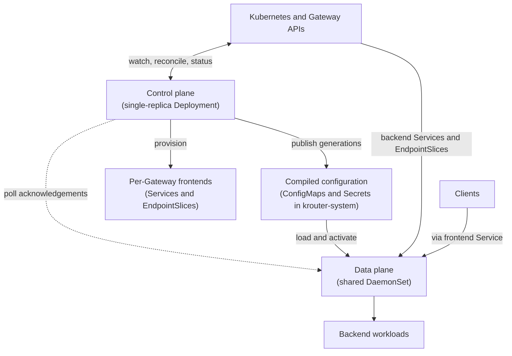
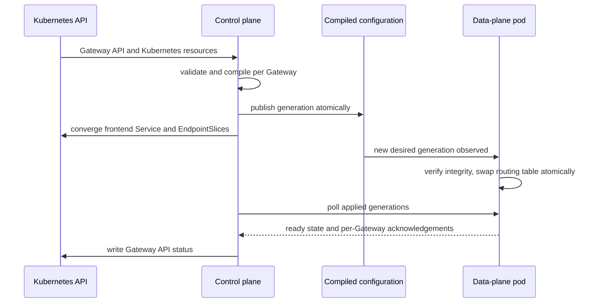

# Architecture

krouter is split into two cooperating components with strictly separated
responsibilities: a **control plane** that observes the Kubernetes API and
compiles configuration, and a **data plane** that serves traffic from that
compiled configuration. They communicate exclusively through Kubernetes
objects; there is no direct connection from the control plane into the
request path.

## Component model

## Control plane

The control plane:

- Runs as a single-replica Deployment.
- Performs no leader election.
- Watches GatewayClass, Gateway, HTTPRoute, ReferenceGrant, Service, Secret,
  Namespace, Pod, and EndpointSlice resources required by the
  implementation.
- Validates attachment, references, listener conflicts, parameters, and all
  other Gateway API semantics.
- Compiles accepted Gateway and HTTPRoute configuration
  (see [configuration.md](configuration.md)).
- Allocates internal listener ports (see [frontend.md](frontend.md)).
- Creates per-Gateway frontend Services and their EndpointSlices.
- Copies only referenced and authorized TLS material into generated Secrets
  (see [security.md](security.md)).
- Manages the scoped RBAC needed by the shared data plane to read backend
  Services and EndpointSlices.
- Polls every healthy data-plane pod for its applied configuration
  generations (see [status.md](status.md)).
- Owns all Gateway API status updates.

If the control plane is unavailable, existing data-plane pods continue
serving. Gateway changes, status changes, frontend endpoint mirroring, and
discovery of replacement data-plane pods pause until it recovers.

## Data plane

The data plane:

- Runs as one shared DaemonSet in `krouter-system`.
- Runs on every eligible worker node by default.
- Uses the same executable and image as the control plane.
- Serves every Gateway owned by the installation.
- Watches only controller-generated configuration and TLS material in
  `krouter-system`.
- Watches authorized backend Services and EndpointSlices directly.
- Holds no durable local state.
- Uses all CPUs made available to its container.
- Listens on dynamically allocated internal ports, not host ports.
- Never writes Gateway API status.

The data plane MUST isolate request handling and configuration errors by
Gateway so a rejected update for one Gateway does not reload or invalidate
another Gateway.

## Reconciliation loop

The control plane runs a level-triggered reconciliation loop: every pass
observes the complete desired state, compiles it, converges the generated
objects, and reports status. The loop MUST be idempotent and tolerant of
duplicate or missed watch events.

## Architectural invariants

1. The control plane is never on the request path.
2. The data plane is stateless: any pod can be rebuilt from the published
   configuration alone.
3. Configuration activates atomically per Gateway; a request never observes
   a partially applied generation.
4. A data-plane pod that cannot load a new generation keeps serving the
   last valid one.
5. The control plane is the sole writer of Gateway API status.
6. Errors are isolated per Gateway: one Gateway's invalid configuration
   never disturbs another Gateway's traffic.
7. All reconciliation is idempotent; generated objects are converged, never
   assumed.
