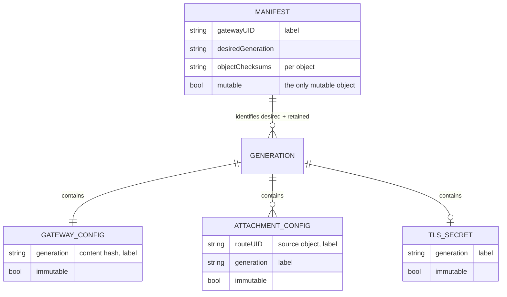
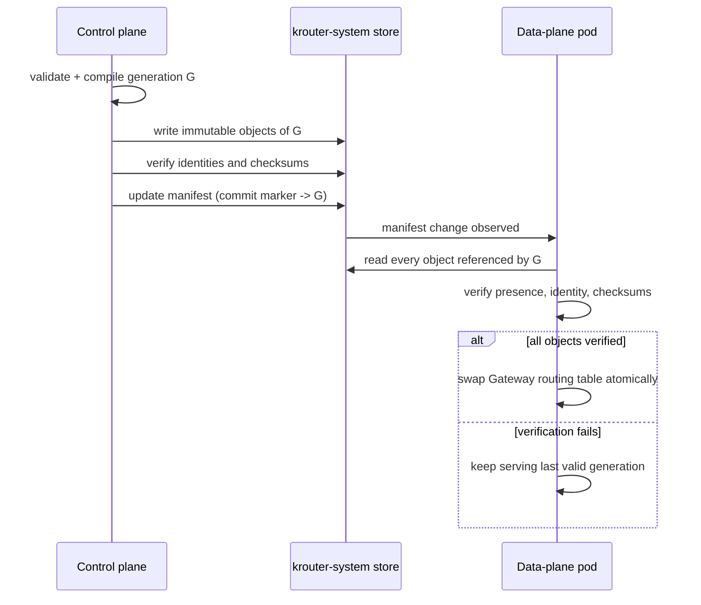

# Compiled configuration

Compiled configuration is the contract between the control plane and the
data plane: internal, machine-generated JSON stored in `krouter-system`. It
is not a user-facing API.

## Object model

For each Gateway, the control plane creates:

- One immutable Gateway configuration ConfigMap per generation.
- One immutable ConfigMap per `(Gateway, Route)` attachment per generation.
- One immutable generated TLS Secret per generation when TLS material is
  needed.
- One small mutable manifest ConfigMap identifying the desired generation
  and every object/checksum in that generation.

An HTTPRoute attached to multiple Gateways produces a separate attachment
configuration for each Gateway.

Every object carries labels identifying the installation, Gateway UID,
source object UID, and generation. User-provided names are informational;
UIDs prevent delete-and-recreate ambiguity.

## Atomic publication

The control plane publishes a generation as follows:

1. Validate and compile the complete Gateway configuration.
2. Write all immutable attachment ConfigMaps and the generated Secret.
3. Verify the stored objects and checksums.
4. Update the manifest ConfigMap as the commit marker.

Data-plane pods activate a generation only after every referenced object is
present, has the expected identity, and matches its checksum. The complete
in-memory routing table for that Gateway is then swapped atomically.

Generations are scoped to a Gateway. Updating one Gateway MUST NOT reload
another.

## Last-valid behavior

If a data-plane pod cannot load the desired generation:

- It continues serving that Gateway's last valid generation.
- Its Kubernetes readiness stays true if the last valid generation remains
  serviceable.
- Its status endpoint reports the desired generation, applied generation,
  and error (see [status.md](status.md)).
- The Gateway/Routes do not receive `Programmed=True` for the failed
  generation.

The control plane MUST retain at least the current desired generation and
the preceding successfully programmed generation so a newly started pod can
recover. Older generations are garbage-collected only after the desired
generation has been acknowledged and the retention rule is satisfied.

Invalid user configuration is different from a data-plane load failure:
rejected Routes are excluded from the next valid generation and receive
negative status conditions rather than being served indefinitely from stale
configuration.

## Ownership and garbage collection

- Frontend Services have the Gateway as owner.
- Frontend EndpointSlices have the generated Service as owner.
- Central generated configuration is labelled with the source UIDs and
  removed by control-plane garbage collection, because cross-namespace
  owner references are not valid.
- Deleting a Route publishes a new Gateway generation without that
  attachment.
- Deleting a Gateway removes its Service, EndpointSlices, generated
  configuration, TLS material, and internal listeners.
- Recreating an object with the same name but a new UID is treated as a
  distinct object.
- Manually deleted generated resources are recreated while their owning
  Gateway remains accepted.

The controller SHOULD avoid finalizers unless cleanup cannot be completed
safely through owner references and orphan garbage collection. Gateway
deletion MUST NOT be blocked indefinitely by an unavailable data-plane pod.
