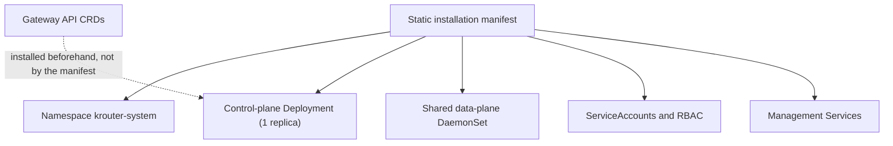

# Deployment

## Distribution artifacts

krouter is distributed as:

- One container image containing a single executable.
- One static Kubernetes manifest.
- One `krouter-system` namespace.
- One single-replica control-plane Deployment.
- One shared data-plane DaemonSet.
- The ServiceAccounts, RBAC, and management Services required by those
  components.

The manifest MUST NOT install Gateway API CRDs.

## Runtime settings

The executable role is selected with `KROUTER_MODE=controlplane` or
`KROUTER_MODE=dataplane`. Installation-level application settings use
`KROUTER_*` environment variables. Pod scheduling fields such as node
selectors, affinity, and tolerations remain ordinary fields in the
installation manifest.

At minimum, the installation MUST expose these settings:

| Environment variable | Meaning |
|---|---|
| `KROUTER_MODE` | `controlplane` or `dataplane` |
| `KROUTER_CONTROLLER_NAME` | Unique Gateway API controller name owned by this installation |
| `KROUTER_SYSTEM_NAMESPACE` | Namespace containing krouter; defaults to `krouter-system` |
| `KROUTER_INTERNAL_PORT_MIN` | First allocatable data-plane listener port |
| `KROUTER_INTERNAL_PORT_MAX` | Last allocatable data-plane listener port |
| `KROUTER_MANAGEMENT_PORT` | Health, status, and metrics port |
| `KROUTER_LOG_LEVEL` | Minimum log level: `debug`, `info`, `warn`, or `error` |

The default internal listener range MUST use unprivileged ports and MUST NOT
overlap the cluster's default NodePort range. A suitable default is
`10000-29999`.

## Multi-instance isolation

Each installation has a unique `KROUTER_CONTROLLER_NAME`. It MUST reconcile
every GatewayClass whose `spec.controllerName` exactly matches that value,
and only resources attached to those classes.

Installing another krouter instance with a different controller name and
GatewayClass provides:

- Separate control- and data-plane compute.
- Separate configuration and TLS material.
- Separate resource limits and failure domains.

No per-Gateway data-plane workload is created.
