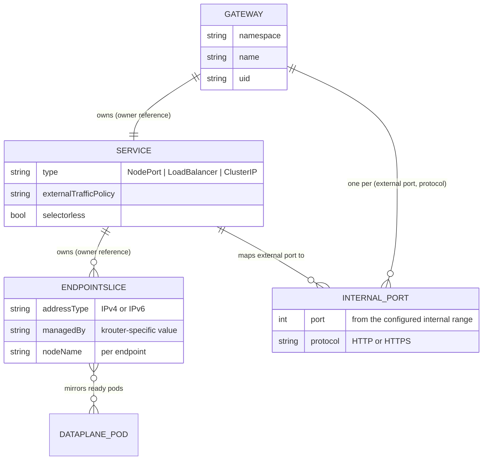

# Gateway frontends

How traffic enters the shared data plane: one Service per Gateway, backed by
controller-managed EndpointSlices that mirror the data-plane pods, mapped to
dynamically allocated internal listener ports.

## One Service per Gateway

The control plane creates one Service for each accepted Gateway. This
permits a distinct cloud load balancer per Gateway when requested.

Generated Services:

- Live in the Gateway's namespace.
- Have no pod selector because the shared DaemonSet lives in
  `krouter-system`.
- Have an owner reference to the Gateway.
- Carry the labels required by the Gateway API in-cluster deployment model,
  including `gateway.networking.k8s.io/gateway-name`.
- Carry every label and annotation declared under
  `Gateway.spec.infrastructure`; krouter-owned keys cannot be overridden.
- Default to `type: NodePort` and `externalTrafficPolicy: Local`.
- MAY instead be configured as `LoadBalancer` or `ClusterIP` through Gateway
  infrastructure parameters (see [parameters.md](parameters.md)).

## Mirrored EndpointSlices

For every generated Service, the control plane creates and manages
EndpointSlices in the same namespace. These slices:

- Use `kubernetes.io/service-name` to associate with the Service.
- Use a krouter-specific `endpointslice.kubernetes.io/managed-by` value.
- Mirror ready shared data-plane pod IPs.
- Include each pod's node name so `externalTrafficPolicy: Local` can select
  node-local endpoints.
- Represent IPv4 and IPv6 addresses in separate slices.
- Are split before reaching Kubernetes EndpointSlice size limits.
- Are owned by the generated Service.

The Service behaves as a normal selectorless Kubernetes Service backed by
controller-managed EndpointSlices.

## Gateway addresses

The Gateway publishes the generated Service's address in
`status.addresses`. `spec.addresses` entries that carry a type but no
value MUST be accepted: the controller assigns the address exactly as if
the field were unset. Listeners MAY use any valid port, including
registered ports such as 8080.

## Internal listener ports

Different Gateways may expose identical external listener ports and
hostnames. The control plane therefore allocates a unique internal target
port for each `(Gateway UID, external port, listener protocol)` group.

- HTTP listeners sharing an external port for the same Gateway share one
  internal listener and are distinguished by hostname and routing rules.
- HTTP and HTTPS listeners use different internal listeners.
- TLS passthrough listeners sharing an external port for the same Gateway
  share one internal listener and are distinguished by SNI.
- TCP and UDP listeners carry no hostname, so a Gateway MUST NOT declare
  more than one TCP listener and one UDP listener per external port; each
  such listener group maps to its own internal listener.
- The Service maps the Gateway's declared external listener port to the
  allocated internal port, using the listener's transport protocol (TCP,
  or UDP for UDP listeners).
- The allocation MUST be persisted in generated Service/configuration state
  and reconstructed from that state after a control-plane restart.
- An exhausted internal port range sets an appropriate negative Programmed
  condition and MUST NOT steal or renumber an active allocation.

## Listener sets

A ListenerSet attaches additional listeners to a parent Gateway. Merged
listeners get the same validation, internal port allocation, Service
exposure, and data-plane treatment as the Gateway's own listeners.

- A Gateway MUST NOT accept ListenerSets unless its `allowedListeners`
  field admits the set's namespace; the default admits none, and rejected
  sets receive `Accepted=False` with reason `NotAllowed`.
- Effective listeners are merged in precedence order: the Gateway's own
  listeners first, then each accepted ListenerSet by creation time.
- Two effective listeners sharing a port conflict when their protocols
  differ (`ProtocolConflict`) or when their protocol and hostname are both
  equal (`HostnameConflict`): the lower-precedence listener is rejected
  with a `Conflicted` condition and serves nothing.
- Routes attach to a ListenerSet by naming it in `parentRefs`; such routes
  bind only to that set's listeners, and routes attached to the Gateway
  bind only to the Gateway's own listeners.
- Certificate references of ListenerSet listeners resolve in the set's
  namespace; cross-namespace references require a ReferenceGrant naming
  the ListenerSet kind. Grants for the parent Gateway are not inherited.
- The Gateway status publishes the number of attached ListenerSets.
