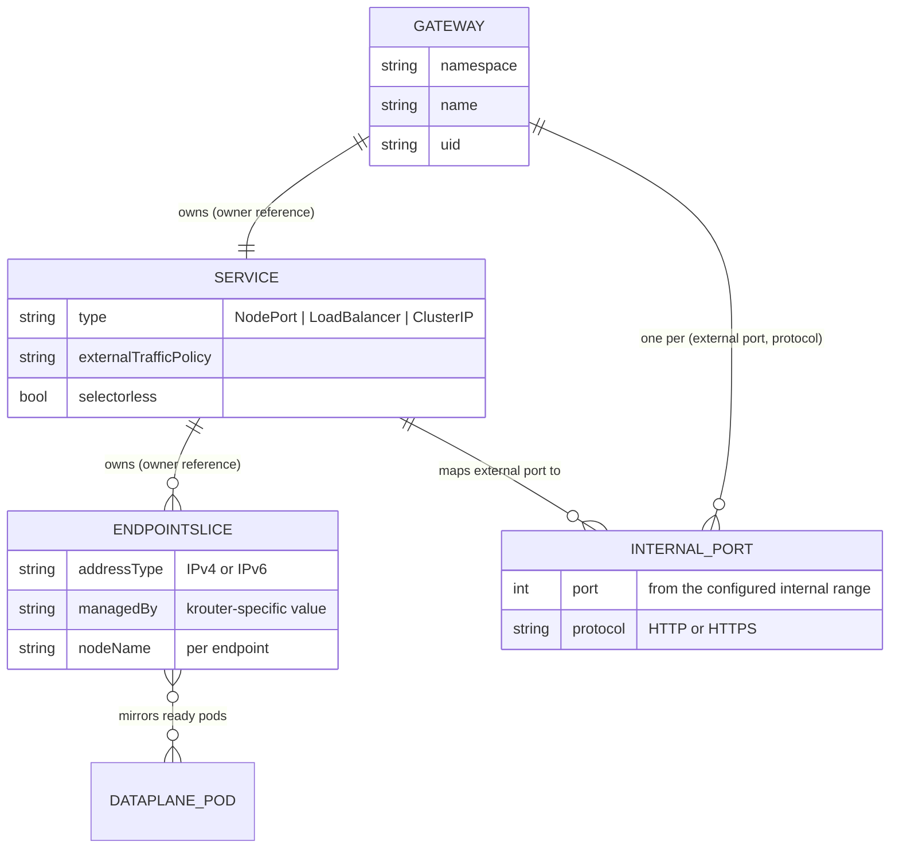

# Gateway frontends

How traffic enters the shared data plane: one Service per Gateway, backed by
controller-managed EndpointSlices that mirror the data-plane pods, mapped to
dynamically allocated internal listener ports.

## One Service per Gateway

The control plane creates one Service for each accepted Gateway. This
permits a distinct cloud load balancer per Gateway when requested.

Generated Services:

- Live in the Gateway's namespace.
- Have no pod selector because the shared DaemonSet lives in
  `krouter-system`.
- Have an owner reference to the Gateway.
- Carry the labels required by the Gateway API in-cluster deployment model.
- Default to `type: NodePort` and `externalTrafficPolicy: Local`.
- MAY instead be configured as `LoadBalancer` or `ClusterIP` through Gateway
  infrastructure parameters (see [parameters.md](parameters.md)).

## Mirrored EndpointSlices

For every generated Service, the control plane creates and manages
EndpointSlices in the same namespace. These slices:

- Use `kubernetes.io/service-name` to associate with the Service.
- Use a krouter-specific `endpointslice.kubernetes.io/managed-by` value.
- Mirror ready shared data-plane pod IPs.
- Include each pod's node name so `externalTrafficPolicy: Local` can select
  node-local endpoints.
- Represent IPv4 and IPv6 addresses in separate slices.
- Are split before reaching Kubernetes EndpointSlice size limits.
- Are owned by the generated Service.

The Service behaves as a normal selectorless Kubernetes Service backed by
controller-managed EndpointSlices.

## Internal listener ports

Different Gateways may expose identical external listener ports and
hostnames. The control plane therefore allocates a unique internal target
port for each `(Gateway UID, external port, listener protocol)` group.

- HTTP listeners sharing an external port for the same Gateway share one
  internal listener and are distinguished by hostname and routing rules.
- HTTP and HTTPS listeners use different internal listeners.
- The Service maps the Gateway's declared external listener port to the
  allocated internal port.
- The allocation MUST be persisted in generated Service/configuration state
  and reconstructed from that state after a control-plane restart.
- An exhausted internal port range sets an appropriate negative Programmed
  condition and MUST NOT steal or renumber an active allocation.
