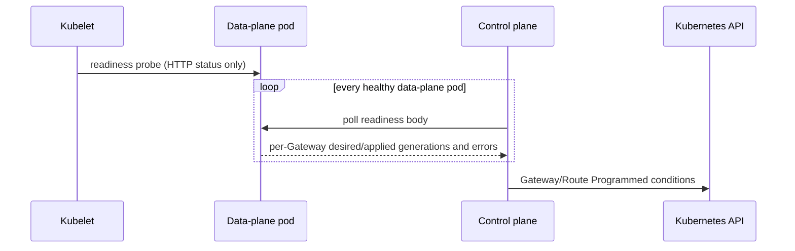

# Status

## Sole status writer

The control plane is the sole status writer.

It MUST implement all status fields and conditions required by Gateway API
v1.6.1, including:

- GatewayClass `Accepted` and `SupportedVersion`.
- GatewayClass `status.supportedFeatures`, listing exactly the Gateway API
  features this implementation supports, sorted by name, so conformance
  tooling can derive the feature set from the cluster.
- Gateway `Accepted` and `Programmed`. Invalid Gateway listeners surface
  on `Accepted` with reason `ListenersNotValid`: the condition stays True
  while at least one effective listener is valid and becomes False when
  none is.
- Per-listener status and attached Route counts.
- Route `status.parents[]` entries with this installation's controller
  name.
- Route `Accepted`, `ResolvedRefs`, and `Programmed` conditions where
  required.
- ListenerSet `Accepted` and `Programmed` conditions, per-listener entry
  statuses (supported kinds, attached routes, conditions), and the parent
  Gateway's `attachedListenerSets` count.
- Correct `reason`, `message`, `lastTransitionTime`, and
  `observedGeneration` values.

## Data-plane acknowledgement

Every data-plane pod exposes a management endpoint whose response includes:

```json
{
  "ready": true,
  "gateways": {
    "<gateway-uid>": {
      "desiredGeneration": "42",
      "appliedGeneration": "41",
      "lastError": "configuration error"
    }
  }
}
```

Kubelet uses only the HTTP status of the readiness endpoint. The control
plane polls the response body directly on every healthy data-plane pod.



For a generation, `Programmed=True` requires:

- At least one healthy data-plane pod.
- Every healthy data-plane pod reports the desired generation as applied.

An unhealthy pod is excluded from the generated frontend EndpointSlices and
therefore does not receive new Service traffic. A healthy pod serving an
older generation keeps readiness but prevents `Programmed=True` for the
desired generation.
