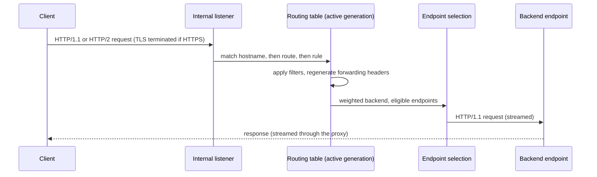

# Traffic

The data-plane request path, its lifecycle guarantees, and the required
HTTP, gRPC, TCP, and TLS passthrough behavior.

## Request path

## gRPC routing

gRPC traffic is HTTP/2 traffic: GRPCRoutes attach to HTTP and HTTPS
listeners, alongside HTTPRoutes, with the same hostname semantics.

- Method matches select by gRPC service and method (exact matching for the
  Core profile), evaluated on their canonical HTTP/2 request form; header
  matches and `RequestHeaderModifier` filters behave as for HTTPRoute
  rules.
- Backend endpoints receive gRPC over cleartext HTTP/2 (h2c), selected per
  request with the same weights, eligibility rules and load-balancing
  algorithm as every other route type.
- Streaming in every direction (unary, server, client, bidirectional) MUST
  flow without buffering, and gRPC trailers MUST be preserved end to end.
- A gRPC request matching no rule receives the gRPC `UNIMPLEMENTED`
  status, as required by the Gateway API.

## TCP forwarding

A TCP listener forwards raw byte streams; nothing is interpreted or
rewritten.

- A TCPRoute attaches to a TCP listener and carries no hostname, path,
  header, or filter semantics: every connection accepted by the listener
  is forwarded to one of the route's backend endpoints.
- The backend endpoint is selected once per downstream connection, applying
  Gateway API backend weights and the GatewayClass load-balancing algorithm
  over eligible endpoints, exactly as for HTTP backends.
- Bytes flow in both directions until either side closes the connection.
- An established connection keeps its selected backend across configuration
  reloads; listener removal stops new accepts while established connections
  finish.

## TLS passthrough

A TLS listener in `Passthrough` mode routes on the SNI value of the
ClientHello and forwards the connection still encrypted; krouter never
terminates the session and never holds the certificate — the backend owns
TLS end to end.

- A TLSRoute attaches to a TLS passthrough listener; its hostnames are
  matched against the SNI value with the same exact-then-wildcard
  precedence as HTTP hostname matching.
- The listener's own hostname restricts which SNI values it serves, as for
  HTTP listeners.
- Once a route is selected, the backend endpoint is chosen once per
  downstream connection, applying the same weights, eligibility rules and
  load-balancing algorithm as every other route type.
- The forwarded stream includes the ClientHello: the backend performs the
  TLS handshake with the original client bytes.
- A connection whose SNI matches no route MUST be refused without
  completing a handshake.
- Established connections keep their selected backend across configuration
  reloads, exactly as for TCP forwarding.

## Connection lifecycle and hot reload

- Configuration reloads occur in process.
- Existing accepted connections and active requests continue using the
  objects that accepted them.
- New requests use the newly activated routing table.
- Old transports, certificates, and routing objects are released only after
  no active request depends on them.
- Listener removal stops new accepts while allowing existing connections to
  finish within normal server limits.
- The termination signal triggers graceful shutdown that completes within
  the pod's Kubernetes termination grace period.

No pod restart is used to apply a Route, Gateway, certificate, or
EndpointSlice change.

## Backend discovery and balancing

For every accepted backend Service reference, the data plane:

1. Resolves the selected Service port.
2. Watches EndpointSlices associated with that Service.
3. Selects endpoints whose conditions make them eligible for new traffic.
4. Excludes unready and terminating endpoints from new requests.
5. Applies Gateway API backend weights before selecting an endpoint.
6. Selects an endpoint using the GatewayClass load-balancing algorithm.

The default is round-robin. Active health checks are not performed.
Kubernetes workload probes and EndpointSlice conditions remain the source of
backend health.

The control plane MUST enforce ReferenceGrant rules before granting the data
plane access to or compiling a cross-namespace backend reference.

## Protocol handling

- Accept HTTP/1.1 and HTTP/2 downstream connections on HTTP and HTTPS
  listeners.
- Accept raw TCP connections on TCP listeners and forward them without
  interpretation.
- Accept TLS connections on TLS passthrough listeners, route by SNI, and
  forward them still encrypted.
- Use HTTP/1.1 for connections to backend endpoints of HTTP routes, and
  cleartext HTTP/2 (h2c) with preserved trailers for gRPC routes.
- Terminate HTTPS using certificates referenced by Gateway listeners.
- Support standard HTTP upgrade behavior required by the Core conformance
  profile.
- Preserve streaming; the proxy MUST NOT buffer complete request or
  response bodies by default.

## Routing and filters

krouter implements the exact matching, precedence, backend weighting,
listener isolation, reference resolution, and filter behavior required by
the Gateway API v1.5.1 `GATEWAY-HTTP`, `GATEWAY-GRPC`, and `GATEWAY-TLS`
Core conformance profiles, and the TCPRoute attachment semantics defined by
the upstream API specification.

No implementation-specific annotations or Route extensions are added.

## Forwarding headers

By default, krouter regenerates spoof-sensitive `Forwarded` and
`X-Forwarded-*` values from the actual downstream connection. Standard
HTTPRoute `RequestHeaderModifier` filters run afterward and MAY add,
replace, or remove those headers for a rule.
