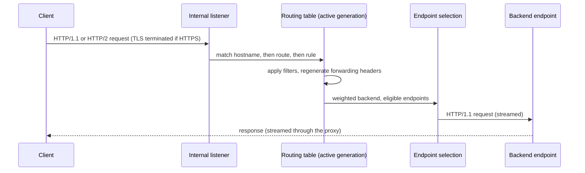

# Traffic

The data-plane request path, its lifecycle guarantees, and the required
HTTP, gRPC, TCP, and TLS passthrough behavior.

## Request path

## gRPC routing

gRPC traffic is HTTP/2 traffic: GRPCRoutes attach to HTTP and HTTPS
listeners, alongside HTTPRoutes, with the same hostname semantics.

- Method matches select by gRPC service and method (exact matching for the
  Core profile), evaluated on their canonical HTTP/2 request form; header
  matches and the supported filters behave as for HTTPRoute rules.
- Backend endpoints receive gRPC over cleartext HTTP/2 (h2c), selected per
  request with the same weights, eligibility rules and load-balancing
  algorithm as every other route type.
- Streaming in every direction (unary, server, client, bidirectional) MUST
  flow without buffering, and gRPC trailers MUST be preserved end to end.
- A gRPC request matching no rule receives the gRPC `UNIMPLEMENTED`
  status, as required by the Gateway API.

## TCP forwarding

A TCP listener forwards raw byte streams; nothing is interpreted or
rewritten.

- A TCPRoute attaches to a TCP listener and carries no hostname, path,
  header, or filter semantics: every connection accepted by the listener
  is forwarded to one of the route's backend endpoints.
- Rules carry no matching semantics on L4 routes, so a route declaring
  more than one rule is ambiguous: it MUST be rejected with reason
  `UnsupportedValue`, never partially applied.
- When several routes attach to one listener, the oldest route (then the
  lexically smallest namespaced name) serves it, deterministically on
  every data-plane pod.
- The backend endpoint is selected once per downstream connection, applying
  Gateway API backend weights and the GatewayClass load-balancing algorithm
  over eligible endpoints, exactly as for HTTP backends.
- Bytes flow in both directions until either side closes the connection.
- An established connection keeps its selected backend across configuration
  reloads; listener removal stops new accepts while established connections
  finish.

## UDP forwarding

A UDP listener forwards datagrams; nothing is interpreted or rewritten.

- A UDPRoute attaches to a UDP listener and carries no hostname, path,
  header, or filter semantics: every datagram received by the listener is
  forwarded to one of the route's backend endpoints.
- Multi-rule routes and several routes on one listener follow the TCP
  forwarding semantics: more than one rule is rejected as ambiguous, and
  the oldest route serves the listener.
- Datagrams are associated into flows by client source address: a flow
  keeps its selected backend endpoint until it has been idle for a bounded
  period, and responses from the backend are relayed to the flow's client.
- The backend endpoint is selected once per flow, applying Gateway API
  backend weights and the GatewayClass load-balancing algorithm over
  eligible endpoints, exactly as for TCP connections.
- Established flows keep their selected backend across configuration
  reloads; listener removal stops the listener and expires its flows.

## TLS passthrough and termination

A TLS listener in `Passthrough` mode routes on the SNI value of the
ClientHello and forwards the connection still encrypted; krouter never
terminates the session and never holds the certificate (the backend owns
TLS end to end).

- A TLSRoute attaches to a TLS passthrough listener; its hostnames are
  matched against the SNI value with the same exact-then-wildcard
  precedence as HTTP hostname matching.
- The listener's own hostname restricts which SNI values it serves, as for
  HTTP listeners.
- Once a route is selected, the backend endpoint is chosen once per
  downstream connection, applying the same weights, eligibility rules and
  load-balancing algorithm as every other route type.
- The forwarded stream includes the ClientHello: the backend performs the
  TLS handshake with the original client bytes.
- A connection whose SNI matches no route MUST be refused without
  completing a handshake.
- Established connections keep their selected backend across configuration
  reloads, exactly as for TCP forwarding.

A TLS listener in `Terminate` mode terminates the session at the gateway
with the listener's `certificateRefs` material, then forwards the
decrypted stream to the selected TLSRoute backend with raw TCP semantics.
Route selection by SNI, refusal of unmatched SNI values, per-connection
backend choice, and reload behavior are identical to passthrough.

`Passthrough` and `Terminate` listeners MAY share one port (mixed
termination): the SNI value selects the listener, which decides per
connection whether the session terminates at the gateway.

## Backend TLS

A BackendTLSPolicy targeting a backend Service (optionally narrowed to one
Service port by `sectionName`) upgrades connections from the gateway to
that backend to TLS:

- The `validation.hostname` value is sent as SNI and verified against the
  backend certificate.
- `validation.subjectAltNames` entries (`Hostname` or `URI`), when present,
  replace hostname verification: the backend certificate MUST match at
  least one of them, and `validation.hostname` is then only used for SNI.
- The certificate chain is verified against `caCertificateRefs` ConfigMaps
  (key `ca.crt`) or, with `wellKnownCACertificates: System`, the system
  trust store.
- Verification failures MUST fail closed: the request is answered with a
  bad-gateway response, never sent in cleartext.
- A policy with an unresolvable or invalid CA reference is rejected
  (`Accepted=False`/`NoValidCACertificate`,
  `ResolvedRefs=False`/`InvalidKind` or `InvalidCACertificateRef`) and its
  backends fail closed.
- Two policies targeting the same Service and port conflict: the oldest
  wins and later ones are rejected with reason `Conflicted`.
- Policy status is reported per Gateway ancestor with this installation's
  controller name.

`Gateway.spec.tls.backend.clientCertificateRef` MAY reference a
`kubernetes.io/tls` Secret; its keypair is then presented as the client
certificate on every backend TLS connection of that Gateway. The Gateway
publishes a `ResolvedRefs` condition: an unresolvable, malformed, or
wrongly typed reference sets it to False with reason
`InvalidClientCertificateRef`; a cross-namespace reference without a
ReferenceGrant sets reason `RefNotPermitted`. The Gateway stays accepted,
and backend TLS connections proceed without a client certificate.

`options` is out of scope: policies using it are rejected as invalid
rather than partially applied.

## Connection lifecycle and hot reload

- Configuration reloads occur in process.
- Existing accepted connections and active requests continue using the
  objects that accepted them.
- New requests use the newly activated routing table.
- Old transports, certificates, and routing objects are released only after
  no active request depends on them.
- Listener removal stops new accepts while allowing existing connections to
  finish within normal server limits.
- The termination signal triggers graceful shutdown that completes within
  the pod's Kubernetes termination grace period.

No pod restart is used to apply a Route, Gateway, certificate, or
EndpointSlice change.

## Backend discovery and balancing

For every accepted backend Service reference, the data plane:

1. Resolves the selected Service port.
2. Watches EndpointSlices associated with that Service.
3. Selects endpoints whose conditions make them eligible for new traffic.
4. Excludes unready and terminating endpoints from new requests.
5. Applies Gateway API backend weights before selecting an endpoint.
6. Selects an endpoint using the GatewayClass load-balancing algorithm.

The default is round-robin. Active health checks are not performed.
Kubernetes workload probes and EndpointSlice conditions remain the source of
backend health.

The control plane MUST enforce ReferenceGrant rules before granting the data
plane access to or compiling a cross-namespace backend reference.

## Protocol handling

- Accept HTTP/1.1 and HTTP/2 downstream connections on HTTP and HTTPS
  listeners.
- Accept raw TCP connections on TCP listeners and forward them without
  interpretation.
- Accept UDP datagrams on UDP listeners and forward them per flow without
  interpretation.
- Accept TLS connections on TLS passthrough listeners, route by SNI, and
  forward them still encrypted.
- Use HTTP/1.1 for connections to backend endpoints of HTTP routes, and
  cleartext HTTP/2 (h2c) with preserved trailers for gRPC routes.
- Honor the backend Service port `appProtocol`: `kubernetes.io/h2c`
  backends are dialed with cleartext HTTP/2, and `kubernetes.io/ws`
  backends over HTTP/1.1 with standard upgrade passthrough. WebSocket
  upgrades MUST traverse the proxy end to end.
- Terminate HTTPS using certificates referenced by Gateway listeners.
- Support standard HTTP upgrade behavior required by the Core conformance
  profile.
- Preserve streaming; the proxy MUST NOT buffer complete request or
  response bodies by default.

## Routing and filters

krouter implements the exact matching, precedence, backend weighting,
listener isolation, reference resolution, and filter behavior required by
the Gateway API v1.6.1 `GATEWAY-HTTP`, `GATEWAY-GRPC`, `GATEWAY-TLS`,
`GATEWAY-TCP`, and `GATEWAY-UDP` Core conformance profiles.

Route `parentRefs` MAY pin listeners by `port` in addition to
`sectionName`. A parentRef carrying only `port` attaches to every listener
of the referenced parent with that port; carrying both, the named listener
MUST also have that port. A parentRef whose port matches no listener MUST
NOT be accepted (reason `NoMatchingParent`).

HTTPRoute matches support paths (`Exact` and `PathPrefix`), methods,
headers (`Exact`), and query parameters (`Exact`, first value of the
parameter). Precedence between matching rules follows the upstream order:
path specificity, then method presence, then number of matched headers,
then number of matched query parameters. Match types outside this set MUST
be rejected with reason `UnsupportedValue`.

HTTP listeners are isolated by hostname: a request is served exclusively
by the most specific listener whose hostname matches the request authority
among the listeners sharing the port. Routes attached to less specific
listeners MUST NOT serve such requests, even when their own hostnames and
matches would apply.

On HTTPS listeners sharing a port, a request whose authority is owned by a
different listener than the one selected by the connection's SNI MUST be
answered `421 Misdirected Request`, so clients retry on a fresh
connection. Authorities owned by the SNI-selected listener itself
(including every authority when that listener has no hostname) are routed
normally.

The following HTTPRoute rule filters MUST be supported with the upstream
Gateway API semantics:

- `RequestHeaderModifier` and `ResponseHeaderModifier`: add, set, and
  remove headers on the proxied request or response.
- `RequestRedirect`: scheme, hostname, port, path replacement
  (`ReplaceFullPath` and `ReplacePrefixMatch`), and the status codes
  permitted by the API. Unset values MUST be inherited from the incoming
  request (an unset port inherits the incoming listener port unless the
  scheme is changed, in which case the new scheme's default port applies)
  and default scheme ports MUST be omitted from the `Location` header.
- `URLRewrite`: hostname replacement and path replacement
  (`ReplaceFullPath` and `ReplacePrefixMatch`) before forwarding.
- `RequestMirror`: a copy of the request is delivered to a single
  endpoint of the mirror backend without influencing the client response;
  mirror failures and responses MUST be ignored. Several mirrors on one
  rule and percentage or fraction sampling MUST be honored.
- `CORS`: preflight requests (`OPTIONS` with `Origin` and
  `Access-Control-Request-Method`) are answered directly by the gateway;
  matching requests receive the configured `Access-Control-*` response
  headers. Origins match exactly, by `*`, or by wildcard host patterns
  (one or more leading labels). Non-matching origins receive no CORS
  headers. Wildcard allow-lists are answered by echoing the requested
  values, so replies stay valid for credentialed requests;
  `Access-Control-Allow-Credentials` is only ever emitted when configured.
  `maxAge` defaults to 5 seconds.

GRPCRoute rules support `RequestHeaderModifier`, `ResponseHeaderModifier`,
and `RequestMirror` with the same semantics.

HTTPRoute and GRPCRoute rules additionally support `ExtensionRef` filters
referencing core ConfigMaps, enabling per-rule rate limiting and WAF
inspection (docs/spec/extensions.md).

Backend references MAY carry their own filters (`backendRefs[].filters`):
`RequestHeaderModifier` and `ResponseHeaderModifier` are supported and
apply only to traffic forwarded to that backend, after the rule-level
filters. Requests mirrored by a rule-level `RequestMirror` MUST NOT be
affected by per-backendRef filters. Any other per-backendRef filter type
rejects the route with `UnsupportedValue`.

HTTPRoute and GRPCRoute rules MAY be named (`rules[].name`). Rule names
MUST be accepted and preserved; they carry no routing behavior.

A route using any other filter type, or a filter value outside the
supported set, MUST be rejected with reason `UnsupportedValue` and MUST NOT
be partially applied.

No implementation-specific annotations are interpreted, and no custom
resources are defined: route extensions are limited to the `ExtensionRef`
ConfigMap contract of docs/spec/extensions.md.

## Timeouts

HTTPRoute `rules[].timeouts` MUST be honored with the upstream Gateway API
semantics:

- `request` bounds the time from the start of the downstream request to
  the start of the gateway's response; exceeding it answers
  `504 Gateway Timeout`.
- `backendRequest` bounds one request to a backend endpoint and MUST NOT
  exceed the effective `request` timeout.
- A zero duration disables the corresponding timeout.
- Timeouts apply per rule; rules without timeouts keep the default
  behavior (no timeout beyond ordinary server limits).

## Forwarding headers

By default, krouter regenerates spoof-sensitive `Forwarded` and
`X-Forwarded-*` values from the actual downstream connection. Standard
HTTPRoute `RequestHeaderModifier` filters run afterward and MAY add,
replace, or remove those headers for a rule.
