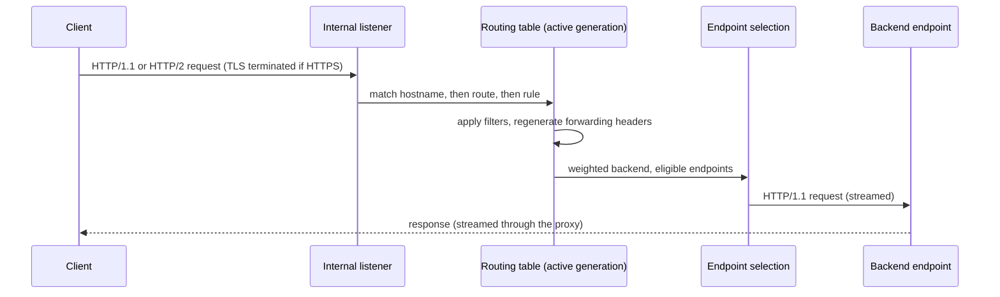

# Traffic

The data-plane request path, its lifecycle guarantees, and the required
HTTP behavior.

## Request path

## Connection lifecycle and hot reload

- Configuration reloads occur in process.
- Existing accepted connections and active requests continue using the
  objects that accepted them.
- New requests use the newly activated routing table.
- Old transports, certificates, and routing objects are released only after
  no active request depends on them.
- Listener removal stops new accepts while allowing existing connections to
  finish within normal server limits.
- The termination signal triggers graceful shutdown that completes within
  the pod's Kubernetes termination grace period.

No pod restart is used to apply a Route, Gateway, certificate, or
EndpointSlice change.

## Backend discovery and balancing

For every accepted backend Service reference, the data plane:

1. Resolves the selected Service port.
2. Watches EndpointSlices associated with that Service.
3. Selects endpoints whose conditions make them eligible for new traffic.
4. Excludes unready and terminating endpoints from new requests.
5. Applies Gateway API backend weights before selecting an endpoint.
6. Selects an endpoint using the GatewayClass load-balancing algorithm.

The default is round-robin. Active health checks are not performed.
Kubernetes workload probes and EndpointSlice conditions remain the source of
backend health.

The control plane MUST enforce ReferenceGrant rules before granting the data
plane access to or compiling a cross-namespace backend reference.

## Protocol handling

- Accept HTTP/1.1 and HTTP/2 downstream connections.
- Use HTTP/1.1 for connections to backend endpoints.
- Terminate HTTPS using certificates referenced by Gateway listeners.
- Support standard HTTP upgrade behavior required by the Core conformance
  profile.
- Preserve streaming; the proxy MUST NOT buffer complete request or
  response bodies by default.

## Routing and filters

krouter implements the exact matching, precedence, backend weighting,
listener isolation, reference resolution, and filter behavior required by
the Gateway API v1.5.1 `GATEWAY-HTTP` Core conformance profile.

No implementation-specific annotations or Route extensions are added.

## Forwarding headers

By default, krouter regenerates spoof-sensitive `Forwarded` and
`X-Forwarded-*` values from the actual downstream connection. Standard
HTTPRoute `RequestHeaderModifier` filters run afterward and MAY add,
replace, or remove those headers for a rule.
